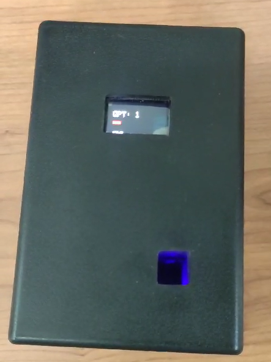

# Spectrofluorometer

This project involves the development of a portable spectrofluorimetry instrument for hydrocarbon prospecting applications. The system comprises a spectrometer chip, a data acquisition system, and an ultraviolet laser system for sample excitation. A proof of concept is designed and implemented, which will undergo various quality control tests, including calibration, laser diode lifespan, and performance in harsh environments such as open fields with high temperature and humidity. Simultaneously, a usage protocol is being developed.

In addition to the embedded user interface, the device has the capability to transmit spectral data via Bluetooth wireless protocol, which can be viewed through a graphical interface built in PyQt. Furthermore, the instrument's working parameters can be configured through both USB cable and Bluetooth. In-situ calibrations can also be performed using these controls, ensuring flexibility and ease of use in various environments.
